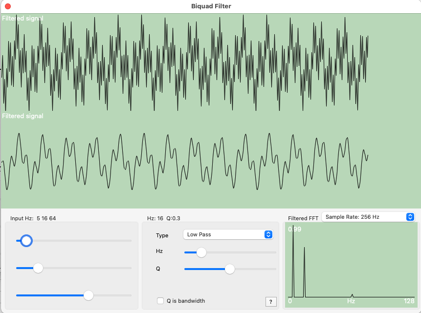

## Filtering Signals

Temporal filters are often used to remove signal drift in brain imaging (brain scans become brighter or darker gradually during scannning) or external noise in electrophysiological data (e.g. 50-60Hz noise due to electrical signals). Biquad filters are often used as temporal filters, though they can be used in other applications as well (e.g. across space instead of time). Biquad filters allow us to adjust the amplitude of frequencies in a signal, in the same way that we use an audio equalizer to adjust whether we want our music to emphasize or attenuate the bass or treble.

  
This Lazarus/Delphi project demonstrates the biquad filters described by [Robert Bristow-Johnson](https://webaudio.github.io/Audio-EQ-Cookbook/audio-eq-cookbook.html). In addition, the software generates a Fast Fourier Transform (FFT) and shows the signal energy after the filter is applied. This allows you to observe how the filters tend to have roll-off near their target frequency (e.g. a 60 Hz notch filter will also attentuate signals at 50 Hz and 70Hz, though to a lesser extent). The source code includes both graphical and console terminal applications that compile with Delphi, FreePascal or Lazarus, allowing you to create programs for Windows, Linux and macOS.

##### Installation

The first step is to download and unzip our software

 - [A pre-compiled version is also available](https://github.com/neurolabusc/biquad-filter/releases)
 - The [Lazarus](https://www.lazarus-ide.org) source code is available which can be used to compile the software for macOS, Windows and Linux from [hhttps://github.com/neurolabusc/biquad-filter](https://github.com/neurolabusc/biquad-filter)

##### Usage

When you launch the program, you will see a sine wave in the top graph and the filtered data in the lower graph. Adjusting the three sliders in the Input panel allows you to set the frequencies of the input signal. The panel on the right allows you to select which filter to apply to the input data in order to generate the output signal. You can tune the following parameters:

 - Type: This specifies the kind of filter to apply. Your options are [Low Pass](https://en.wikipedia.org/wiki/Low-pass_filter), [High Pass](https://en.wikipedia.org/wiki/High-pass_filter), Band Pass CSG, Band Pass CZPG, Notch, All Pass, Peaking, Low Shelf and High Shelf. A low pass filter attenuates signals above the target frequency, a high-pass filter dampens signals below the target, band pass filters dampen all frequencies except those near the target, an all pass filter amplifies or dampens all frequencies evenly (though it influences phase), a peak filter preserves all frequencies but amplifies those near the target frequency, shelf filters preserve all frequencies, but somewhat increases or decreases frequencies below (low shelf or above (high shelf) the target frequency.
 - Hz: Specify target frequency. Center Frequency or Corner Frequency, or shelf midpoint frequency, depending on filter type.
 - Gain dB: Used only for peaking and shelving filters. These filters pass all frequencies, but will increase or decrease the intensity of the target frequencies by this amount.
 - Q: By default, this value specifies the [Quality factor](https://en.wikipedia.org/wiki/Q_factor), tuning the selectivity of the filter. However, if “Q is bandwidth” is checked, this value sets the bandwidth in octaves.
 - Q is bandwidth: See above.
 - Filter both forward and reverse: Many filters cause shift signals such that they appear to occur later in time. Running the filters in both directions minimizes this effect.

##### Links

 - [Jean-Pierre Moreau](http://jean-pierre.moreau.pagesperso-orange.fr/p_signal.html) provides a Pascal implementation of the Butterworth low pass filter.
 - [ACS](https://wiki.lazarus.freepascal.org/ACS) is an open source Delphi and Lazarus project that includes code for many filters.

